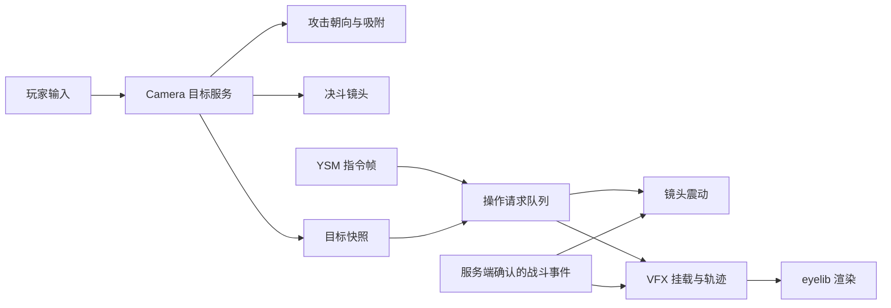

# YesSteveCamera：战斗镜头与索敌开发方案

创建日期：2026-09-27；最近需求对齐：2026-09-29。状态：YSS 源码审计完成，进入 P0 兼容层实现前的基线阶段。

本文保存用户提出的需求和建议方案。已确认的需求、源码事实与建议默认值分别标明；所有新增类、配置结构、命令、MoLang 函数名均为候选设计，不能当作已有 API 使用。下一轮先对齐第 12 节，再正式开发。

## 1. 目标与用户需求

面向 Minecraft 1.20.1 Forge，为 YSM 动作、YesSteveVFX 特效补齐镜头与索敌控制，以用户的 ShoulderSurfing fork 为开发仓库。

已提出的功能需求：

1. 角色攻击方向与鼠标控制的观察方向解耦，自动面向敌人并靠近；进入合适距离后停止靠近。具体攻击行为由 YSS 或其他战斗 mod 负责；Camera 只提供目标、朝向和吸附辅助。
2. 按配置划分默认索敌敌人、需要主动锁定的友善/中立生物、不可锁定和吸附攻击的保护名单生物。支持模组实体和兼容接口，无法可靠识别时可默认归入友善/中立类。
3. 短按鼠标中键锁定最接近准心的合法目标，显示锁定标记；长按中键取消。锁定期间镜头形成玩家居左、目标居右的决斗构图，取消后回到常规位置。
4. 可配置平移、旋转、缩放等震动预设，支持幅度、次数、时长以及每次震动的独立延迟。
5. 震动支持指令、YSM MoLang 指令帧、玩家命中、玩家受伤和其他模组生物技能接口。
6. 向 VFX 提供目标信息，实现朝目标方向发射、持续追踪、出现在目标当前坐标、挂载到目标身上四种特效。
7. 本次先准备仓库与文档，对齐具体需求后再实现。

## 2. 已核实的开发基线

| 项目 | 2026-09-27 本地核实结果 |
|---|---|
| 开发仓库 / origin | `https://github.com/DanielFQZ/YesSteveCamera.git` |
| 本地目录 | `E:\JavaProject\YesSteveCamera` |
| fork 来源 | `Exopandora/ShoulderSurfing` |
| 克隆时 origin/master | `ef61d3eaeb68aef2710c1ed5e9e933e86b4b4965`，Release version 5.1.1 |
| 选用基线 | `1.20.1-4.21.0` 标签 |
| 基线提交 | `6f9e66c5b92201d5c4e99eadbd5fd5eb1705e364` |
| 本地开发分支 | `dev/1.20.1`，从上述标签创建 |
| 目标平台 | Minecraft 1.20.1 / Forge；现有多平台目录先保留 |
| 基线编译依赖 | Forge `1.20.1-47.0.1`，见 `gradle/libs.versions.toml` |
| 基线工具链 | Java 17；Gradle Wrapper 8.7 |
| 测试客户端 | `E:\Games\YSM拍摄端\.minecraft\versions\1.20.1-Forge_47.4.16` |
| 客户端 JAR | `mods\[越肩视角重制] ShoulderSurfing-Forge-1.20.1-4.21.0.jar` |
| JAR 内部元数据 | `modId=shouldersurfing`，`version=1.20.1-4.21.0` |
| 参考 VFX 基线 | `E:\JavaProject\YesSteveModel\YesSteveVFX`，提交 `b38b30631622d993e3d7173f66e5731fa07f08d1` |
| 参考 YSM | `E:\JavaProject\YesSteveModel\YesSteveModel-dev-1.20`，尤其是其 `docs` |

客户端 JAR 的版本元数据与所选源码标签一致；这不是对二进制可重复构建的一致性认证。目前没有执行 Gradle 构建或游戏测试。源码使用的 Forge 47.0.1 与测试环境 47.4.16 是两个不同基线，正式声明支持范围前要分别验证。

后续以此 fork 作为开发和推送目的地。不要把默认分支的新 Minecraft 版本源码直接混入 1.20.1 分支。是否另设 upstream remote、调整默认分支，等有实际同步或发布需要时处理。

YesSteveCamera 是 ShoulderSurfing 的功能性 fork，计划替换原 JAR，不能同时让两套相机和输入修改运行。产品名称使用 YesSteveCamera；`modId`、包名、公开 API 兼容和配置迁移方式列为待确认项，不在准备阶段全局替换。保留 MIT 许可证及原作者信息；发布前也需调整继承的上游发布项目 ID，避免误发到上游项目。

### 已检查的源码接入点

下列路径相对于仓库根目录，结论来自匹配标签下的本地源码：

| 路径 / 方法 | 现状及对设计的影响 |
|---|---|
| `common/src/main/java/com/github/exopandora/shouldersurfing/client/InputHandler.java`：`updateMovementInput` | 全向移动会变换输入向量，并在解耦状态设置玩家 yaw/pitch；攻击朝向必须与此处协调 |
| 同目录 `ShoulderSurfingImpl.java`：`tick`、`lookAtCrosshairTargetInternal`、`changePerspective` | 瞄准/转向锁期间及退出越肩时存在准心转向；仅另加目标转向监听会互相覆盖 |
| 同目录 `ShoulderSurfingCamera.java`：`calcRotations`、`calcOffset`、`maxZoom` | 已有旋转、偏移插值、偏移回调和碰撞限距，可复用基础流程 |
| 同目录 `ObjectPicker.java` | 现有准心拾取入口；战斗目标与普通交互拾取需要分开设计 |
| `common/src/main/java/com/github/exopandora/shouldersurfing/mixins/MixinCamera.java` | 在 Camera.setup 中应用自定义旋转、偏移和 sway，是最终相机变换的协调点 |
| `api/.../callback/ITargetCameraOffsetCallback.java`、`ICameraRotationSetupCallback.java` | 已有偏移及鼠标旋转设置回调；不等于已经具备独立战斗镜头时间轴 |
| `api/.../callback/IPlayerInputCallback.java` | 当前只允许要求保留原版移动输入，不是任意移动/朝向覆写接口 |
| `forge/.../event/ClientEventHandler.java` | tick、移动输入、准心投影和 ComputeCameraAngles 接入，已有 roll 叠加 |
| `forge/.../ShoulderSurfingForge.java` | 客户端初始化及 DisplayTest；新增服务端功能需要单独设计 common/server 初始化和协议协商 |

## 3. 架构与职责

| 模块 | 建议职责 |
|---|---|
| Camera 目标服务 | 分类、候选查询、自动选敌、主动锁定、目标快照、切换与失效通知 |
| Camera 战斗辅助 | 消费攻击意图、朝向协调、短距离吸附、移动释放条件、战斗框架适配；不实现伤害、连招或攻击频率 |
| YSS（YesSteveSkill） | YSM 动画监听、攻击运行时、骨骼命中判定、Root Motion、Caster Move、Hover、Hitstop/Interrupted、击退/击飞、服务端伤害校验，以及动画自带 Camera 轨道 |
| Camera 镜头服务 | 常规/决斗构图、碰撞、平滑、震动、镜头状态恢复 |
| YSM 兼容层 | 注册 MoLang 操作和只读查询；将动画指令帧变成有边界的操作请求 |
| VFX 兼容层 | 将明确的来源、目标和运动模式传给 VFX；不复制渲染后端 |
| YesSteveVFX | 资源、播放实例、挂载、视觉轨迹、视觉接触及实例结束 |
| eyelib | 经 VFX 渲染模型、动画和粒子 |
| 服务端/战斗模组 | 攻击合法性、技能规则、伤害与真实命中，以及必要的同步 |

Camera 的基础锁定和镜头独立于 YSM/VFX。没有 VFX 时使用内置锁定光标；有 VFX 时允许以 Bedrock 粒子替换。YSS 已经拥有攻击和动画镜头运行时，因此 Camera 通过适配层消费 YSS 状态，不复制攻击判定、伤害或 Root Motion。新功能预计主要修改 Camera，并按需要在 YSS 侧增加公开兼容接口；当前没有证据要求改动 YSM 或 eyelib 核心。

### 3.1 完整源码审计后的最终责任矩阵

这部分以 YSS 仓库 `7fad4e64f789d1f31b3c58532d8821099711e541`（2026-09-29）为准，覆盖源码而不是只依据旧版 JAR：

| 能力 | 负责模块 | Camera 的接入方式 |
|---|---|---|
| YSM 动画、控制器、指令帧 | YSM | 通过 YSM 已有动画事件/绑定边界读取，不修改 YSM |
| 攻击动画、骨骼判定、命中段 | YSS | Camera 提供目标快照/方向信息，最终合法命中仍由 YSS 服务端确认 |
| Root Motion、Caster Move | YSS | Camera 只提交独立的吸附辅助贡献，不能覆盖或重复应用 YSS 位移 |
| Hover、Hitstop、Interrupted、击退/击飞 | YSS | Camera 读取状态并按优先级暂停或撤销辅助 |
| 自动选敌、主动锁定、分类、目标生命周期 | YesSteveCamera | 发布不可变目标快照，供 YSS/VFX 适配层消费 |
| 玩家朝向、吸附与普通输入释放 | YesSteveCamera + 适配层 | 与 YSS 位移及闪避强制打断仲裁 |
| 动画 Camera 轨道 | YSS | 与 ShoulderSurfing 最终相机位置合成并统一碰撞约束 |
| 决斗构图、震动 | YesSteveCamera | 作用于最终相机输出，不能反向改变目标查询/攻击射线 |
| 模型/粒子特效渲染 | YesSteveVFX/eyelib | Camera 只提交方向、固定坐标、追踪或挂载请求 |
| 真实伤害和多人权威同步 | YSS 或后续 Paper/战斗插件 | 客户端 Camera/YSM MoLang 不能单独决定结果 |

源码审计确认 YSS 当前原版攻击拦截仍检查 `Minecraft.hitResult instanceof EntityHitResult`。`YssAttackService.shouldCancelVanillaAttack(Minecraft)` 虽然公开存在，但在本次源码中没有输入事件调用方。因此第一版兼容层必须明确处理“锁定目标与准心目标不一致”的输入仲裁；不能只在 Camera 重复监听攻击事件，也不能把该方法当成已经生效的 API。



### 客户端与服务端边界（2026-09-28 已确定解耦方向）

- 纯客户端：镜头、选敌 UI、局部攻击辅助、动画指令帧的本地表现。保持服务器已有攻击范围、碰撞与攻击频率约束；不能声称仅凭客户端就能可靠确认服务器最终伤害或让旁观者看到相同轨迹。
- 完整模式：后续独立开发 Paper 插件或对接已有战斗插件，负责服务端规则、命中确认和多人同步；客户端核心不依赖 Bukkit/Paper，Paper 插件不依赖 Forge/Minecraft 客户端类。不以服务器安装 Forge mod 为前提。
- 通信计划采用 Minecraft 自定义 payload 与 Paper Plugin Messaging Channel 对接，协议编解码和消息模型独立于平台。不能把 Forge 专属登录握手或服务器 Forge SimpleChannel 作为必要条件。正式实现时验证 Forge 客户端连接 Paper、通道注册、代理转发和消息大小限制。
- 协议包含版本/能力握手、目标/技能请求、确认结果和取消事件；服务端未安装插件时不要求握手，保留不依赖插件的本地能力。按实际需求同步，吸附权限帧无需逐帧上报。若未来需要单机完整事件确认，可另加集成服务器适配器，不让 Paper 代码运行在单机中。
- 锁定实体信息和施法请求必须校验发送者、维度、实体有效性、距离与技能权限；实际伤害不由客户端 MoLang 决定。
- 服务端可以禁止某些辅助或限制范围；本地分类配置不能越过服务端禁止规则。握手缺失时只启用允许的本地功能。
- 所有网络引用使用 UUID + 维度，实体数字 ID 只作短期定位优化。断线、换世界和重生必须清空状态与待执行请求。

## 4. 自动选敌与攻击吸附

### 两种目标状态

- 自动选敌：由攻击意图触发，候选只来自默认敌人类别。保持当前目标并设置切换滞后，避免怪物位置稍变就反复换目标。
- 主动锁定：用户明确选中目标，可包含允许主动锁定的友善/中立实体；在取消或失效之前优先使用。

自动选敌的方向参考与中键选敌分开。中键明确按准心选择；自动攻击则应允许角色朝与鼠标视线不同的方向攻击。自动搜索是否包含屏幕背后、移动方向的权重、360 度范围都要对齐后确定，不能默认为必须在屏幕内。

建议的战斗辅助状态机：空闲 → 选定目标 → 靠近 → 到达攻击距离 → 保持攻击朝向；目标走远时允许重新靠近。攻击输入如何触发和重复仍待确认；2026-09-28 已确定动画通过 MoLang 控制“普通移动能否解除吸附”，并有独立的随时强制打断通道，具体见下文。

### 动画控制的解除权限（2026-09-28 用户已确认）

吸附是否正在运行、普通输入是否允许解除吸附、是否主动锁定目标是三个独立状态。

- 指令帧传入 `0`：禁止玩家通过普通移动等行为解除当前吸附。
- 后续指令帧传入 `1`：允许玩家通过普通移动等行为解除吸附。**仅恢复解除权限，不立即停止吸附，也不自动取消中键锁定。**
- 另注册强制打断指令，供闪避等动作随时解除吸附，不受上述 `0/1` 限制。解除吸附不等于 Camera 自己实现闪避动画、位移、无敌帧或伤害。
- 这次确认的是控制权窗口，不代表已经确定按住自动连砍、单击托管攻击或新的攻击频率规则。

候选语法（尚未实现）：

```text
ctrl.camera_assist_cancelable(0);
ctrl.camera_assist_cancelable(1);
ctrl.camera_assist_break();
```

第一个、第二个指令分别放在动作的禁止普通解除起点和允许解除起点；强制打断放在闪避入口。Blockbench 的帧号最后保存为动画时间点，接口不硬编码“60 帧 = 某个固定秒数”。权限接口本身是否同时启动吸附暂不确定；建议与吸附启动条件分开，避免设置权限意外发起攻击。

实现要求及待验证项：

1. 普通移动权限控制只影响辅助相关输入，不冻结相机、网络位置纠正、重力或击退。后退、侧移、跳跃、冲刺哪些属于解除输入仍需对齐。
2. 闪避输入必须能到达动作系统，不能先被吸附输入屏蔽；在闪避指令执行的安全阶段先解除辅助，再应用闪避位移。仅添加指令帧不会自动让 YSM 动画控制器允许闪避转场，实际动作优先级也需验证。
3. 不能只依赖结束帧恢复：动画被打断/切换/重载、玩家死亡、目标失效、退出世界时释放辅助控制；设置可配置的最长控制时限作为失联兜底。正常暂停不应消耗游戏时间窗口。
4. 使用动作实例代次/令牌隔离旧动作的延迟指令。强制打断后丢弃旧动作的待执行辅助请求，旧动画不能重新夺回控制，新动作可以显式建立新状态。当前 CtrlBinding 是否能可靠提供动作身份需核实；不足时设计显式窗口标识，不能宣称现有接口已自动支持。
5. 中键目标锁定可在解除攻击吸附后保留；取消吸附、取消锁定和结束动画分别处理。受击或切换目标是否强制打断仍是待确认策略。

### 控制规则

1. 用统一控制器协调朝向：强制失控/载具规则、技能显式控制、攻击辅助、普通移动与普通瞄准依次仲裁；最终优先级与战斗系统对齐。保持观察方向、身体/头部朝向和攻击方向三者语义清晰。
2. 不能只旋转渲染模型；实际攻击路径必须使用同一目标和合法攻击范围。普通挖掘、放置、物品交互与远程瞄准继续使用各自的拾取规则。
3. 保留真实输入向量，把辅助移动作为独立贡献量。到达距离后只撤掉辅助前进，不清除击退、重力、跳跃或技能位移。
4. 距离按碰撞箱表面、可用攻击触及范围和容差计算；高低差、巨型生物和多部件 Boss 需要适配，不能只比较两个实体中心点。
5. 停止与重新靠近使用不同阈值；普通移动解除由动画的 `0/1` 权限控制，值为 `1` 后哪些输入解除或绕行待确认。碰撞推挤是否要特殊处理也待确认，第一版不通过取消碰撞强行贴住目标。
6. 限定吸附距离、速度/加速度、最大持续时间和最大允许高低差。保留碰撞与路径直线检查；不能自动越过墙、悬崖或不可通行地形。绕路寻路不列入第一阶段。
7. 攻击动作、攻击节奏和连招由 YSS 或其他战斗 mod 决定。Camera 只消费攻击状态、目标和朝向；不实现按住左键循环挥刀，也不假定 YSS 已自动接管锁定目标输入。
8. 目标死亡、无效、卸载、跨维度、玩家死亡、UI 打开等情形有确定退出规则。一次技能中的目标保持与普通连续攻击的目标保持分开。

## 5. 生物分类与候选查询

| 类别 | 自动选敌 | 主动锁定 | 攻击吸附 |
|---|---|---|---|
| `HOSTILE` 默认敌人 | 允许 | 允许 | 允许 |
| `MANUAL_ONLY` 友善/中立 | 禁止 | 允许 | 主动选定后允许 |
| `PROTECTED` 保护名单（用户所称白名单） | 禁止 | 禁止 | 禁止 |

配置支持实体注册 ID、实体类型 tag 和 mod namespace。显示名称与 ID 分开，避免依赖中文翻译名称进行匹配。明确顺序：实体有效性/服务端禁止 → 显式保护规则 → 实体 ID 规则 → 带优先级的 tag/namespace 规则 → 兼容适配器 → 默认分类；同优先级冲突要有稳定结果并给出诊断。

默认分类可利用原版敌对类型及模组公开信息，但不能仅凭继承 Monster 或某个注册分类就判断所有生物当前对玩家敌对。未知生物默认 `MANUAL_ONLY`；中立实体的愤怒目标、主人、队伍与阵营作为实例级适配信息。自己、宠物、队友、其他玩家的默认保护规则及例外需对齐。

预留 `TargetClassificationProvider`、`TargetAnchorProvider`、`CombatAssistAdapter` 等接口（候选名称）。适配器可报告分类、目标主体/部件、瞄准点、触及范围及不支持的操作。没有通用信息时使用保守默认，不自动猜测其他模组的私有字段。

候选只在附近已加载实体中查询，缓存类型分类；关系和存活状态动态检查。对候选数、遮挡射线次数设预算；不要在每个渲染帧遍历全世界。提供检查命令/UI：实体 ID、分类、规则来源、锁定失败原因和当前距离。

## 6. 主动锁定、标记与决斗镜头

### 输入

- 短按中键：未锁定时选择合法候选中最靠近准心的目标；已锁定时如何切换详见待确认项。
- 长按中键：达到阈值后取消，并吞掉本次释放对应的短按，避免先切目标再取消。
- 提供按键重绑定和左右切换的备选入口。与中键选取方块的冲突只在适用模式下接管；背包/聊天窗口不执行锁定。

中键使用未叠加震动的镜头投影，按候选可见锚点与准心距离评分；检查距离、视锥和遮挡，排除相机后方及无效投影点。大体型目标支持独立锚点。平分时使用稳定排序，当前锁定使用滞后与遮挡宽限。

### 标记

先用内置光标完成调试，再接入 VFX 目标挂载的 Bedrock 粒子。跟随插值后的目标锚点，每个锁定生命周期创建一次实例，不能每帧重新播放。切换/取消/失效均显式停止；无 VFX 时回退内置标记。是否穿墙显示、头顶还是躯干、距离缩放均需配置。

### 镜头

决斗构图把玩家和目标作为两个约束点，默认玩家左、目标右。镜头侧移、距离与观察方向随双方位置和体型计算，不把简单的“沿 X 平移”当作始终有效的构图算法。支持有限鼠标微调与平滑回归。

建议的变换流程：常规或决斗基础姿态 → 临时技能镜头（预留）→ 震动采样 → 最终位置碰撞约束 → 相机与 FOV 输出。碰撞必须覆盖震动造成的位移；与原有 sway/bobbing/受伤倾斜叠加时避免重复应用。

锁定基础姿态与震动后的显示姿态分开：选敌、玩家移动坐标系、攻击射线与技能发射方向不被视觉抖动改变。基础数据按 tick 更新，目标坐标和镜头按 partial tick 连续插值，避免低频追随。平滑参数采用时间尺度，结果不依赖 FPS。

遇墙、窄走廊、目标高度差大或距离变化时优先保证镜头不穿墙，再尽量保证双方在画面内。取消后恢复常规镜头设置与合理的观察方向，避免瞬间扭回角色朝向。第一人称、游泳、骑乘、飞行、旁观视角分别定义启停策略。

## 7. 震动预设与触发

### 数据设计（草案）

建议统一放在 `config/yesstevecamera`：

```text
config/yesstevecamera/
  camera.json          # 镜头偏好及锁定交互
  targeting.json       # 实体分类与辅助策略
  triggers.json        # 命中、受伤等事件到震动预设的映射
  shakes/
    light_hit.json
    heavy_hit.json
    hurt.json
    boss_slam.json
```

尚未确定用 JSON 或 Forge 配置承载各类字段；客户端偏好与服务端约束应分开。所有定义带 schema_version；ID 使用 `namespace:path`。中文支持显示名与磁盘父目录，资源 ID 保持合法规范。将资源来源抽象为字节读取接口，方便以后读取 YSM 容器而不把运行时绑定到绝对路径。

每个预设是一条或多条时间轴轨道：

| 通道 | 单位/语义 |
|---|---|
| translation | 镜头局部坐标或显式世界坐标的 XYZ 位移，单位方块 |
| rotation | yaw/pitch/roll，配置以度为单位，统一约定旋转顺序 |
| fov | 相对 FOV 角度变化，不等同于实体或镜头移动 |
| distance | 相机沿视线的前后位移，受碰撞限制 |

每轨可配置起始时间、持续时间、波形/关键帧、幅度、频率、相位、缓入缓出包络、重复次数及重复间隔。多次冲击可以显式列出每次时间点，让每次延迟不同；时间配置统一用秒，避免 tick 与毫秒混淆。单条轨道的重复简写应展开成同一内部表示。

### 7.1 震动配置决策：曲线放进预设，指令帧只触发

不把 MoLang 指令帧设计成逐帧控制器。指令帧只提交预设 ID、slot 和强度；加速、减速、回弹、衰减等时间行为由预设内部的声明式曲线计算。这样既能表达复杂效果，也不会让异步动画求值承担世界查询或大量状态管理。

预设分成三种可组合的轨道原语：

1. **脉冲轨道**：一次快速偏移，使用 `attack / hold / release` 包络，适合受击、砍击和镜头踢动。
2. **振荡轨道**：在包络内使用正弦、三角、噪声或阻尼振荡，适合连续抖动和回弹。
3. **关键帧轨道**：直接给出若干时间和值，并为每个区间选择 `linear`、`ease_in`、`ease_out`、`smoothstep` 或 `cubic_bezier`，用于特殊的加速减速。

配置示例：

```json
{
  "schema_version": 1,
  "id": "yesstevecamera:heavy_hit",
  "duration": 0.42,
  "tracks": [
    {
      "channel": "rotation",
      "axis": [1.0, 0.15, 0.0],
      "amplitude": 7.0,
      "wave": {"type": "damped", "frequency": 18.0, "damping": 8.0},
      "envelope": {"attack": 0.015, "hold": 0.025, "release": 0.38, "easing": "ease_out"}
    },
    {
      "channel": "translation",
      "axis": [0.0, 0.0, -1.0],
      "keyframes": [
        {"time": 0.0, "value": 0.0},
        {"time": 0.045, "value": -0.08, "curve": "ease_out"},
        {"time": 0.18, "value": 0.035, "curve": "ease_in_out"},
        {"time": 0.42, "value": 0.0, "curve": "ease_out"}
      ]
    }
  ]
}
```

`damped` 是内置阻尼振荡器，用来处理“快速冲击后逐渐停下”的效果；普通开发者无需自己写速度积分公式。关键帧则覆盖无法用标准波形表达的曲线。第一版不开放任意 JavaScript 或任意 MoLang 表达式作为速度函数，只提供有限、可校验的函数名和关键帧，避免配置不可控、不同客户端结果不一致以及动画求值线程安全问题。

复杂效果应优先保存为一个组合预设，例如 `heavy_hit` 内部同时包含旋转脉冲、后坐位移和阻尼回弹。多个 `ctrl.camera_shake(...)` 调用保留给独立事件叠加，例如同一时刻的攻击震动和场景爆炸；它们按 slot、优先级和 blend 策略合成，不要求作者把一个效果拆成几十个指令帧。

建议的触发形式仍保持简单：

```text
ctrl.camera_shake('yesstevecamera:heavy_hit', 'attack', 1.0);
```

`scale` 默认只缩放位移、旋转和 FOV 的幅度，不改变时长；需要改变时间的技能应使用另一个预设，避免同一动作在不同帧率下出现不同节奏。预设运行时使用稳定实例 ID，动画重播、网络重复事件和观察 pass 不会重复创建同一震动。

叠加支持 replace/add/max 等策略（最终名称待定）、slot、优先级、事件去重标识、冷却、实例数量和总幅度限制。提供平移/旋转/FOV 独立强度、全局强度和关闭选项。随机波形使用固定种子与连续采样，暂停/恢复、结束回零与场景切换均有明确规则。

加载先校验再原子替换，失败保留上次有效配置并报告文件/字段。拒绝 NaN、Infinity、负时长和超限重复，不因单个坏文件让运行时处于半加载状态。

### 触发语义

- 调试命令、YSM 帧和外部 API 全部转成同一种 `ShakeRequest`（候选名称）。客户端预览命令与服务端对玩家/范围执行的命令分开。
- 挥刀/蓄力/施法震动：动画指令帧触发，可以在未命中时发生。
- 命中震动：由真实战斗结果触发，不能把左键、挥手或伤害意图当作最终命中。
- 受伤震动：受影响玩家的一次有效受伤；是否包括护盾阻挡、吸收生命、环境伤害、持续伤害以及零血量损失的命中，需明确语义。
- 技能震动：其他模组按位置/目标玩家/半径请求，可有距离衰减；不要求技能作者依赖相机内部类。

事件触发位置需在 1.20.1 的最终伤害流程中验证：伤害事件仍可能取消或被其他模组调整，即使最低优先级监听也不自动构成事后确认。优先使用战斗模组的明确结果接口，必要时在伤害结算返回后归一化。事件 ID 去重，区分扫击多个目标/同技能多段/重复网络消息，客户端预测与服务端确认不能叠成两次。

## 8. YSM MoLang 接入

现有 VFX 的 `src/ysm/.../YsmIntegration.java` 已通过 `CtrlBinding` 注册 `ctrl.vfx_play/stop/set`，并检查 `allowEmitting`、预览/假实体以及参数，最后排入客户端队列。YSM 文档说明动画求值具有线程和副作用边界，新接入延用该方式。

候选接口示意：

```text
ctrl.camera_shake('yesstevecamera:heavy_hit', 'attack', 1.0);
ctrl.camera_shake_stop('attack');
```

以上语句尚不可用。设计含义为预设、slot 和强度；参数个数、函数前缀与查询绑定会在实现前统一。只读锁定查询预留“有目标、距离、方向”等能力，其绑定命名也待确认。

约束：

1. 在 YSM 解析动画之前注册，并检查版本与名称冲突，不覆盖其他扩展函数。
2. 异步求值只捕获字符串、数值、来源 UUID 和不可变目标快照；不保留 Entity、上下文、AST 或参数视图，不跨线程查询世界。
3. 操作排入有界队列，客户端安全阶段执行；查询读取线程安全发布的快照。请求带世界会话标识，重进世界不执行旧请求。
4. 本地角色的镜头指令默认只影响自身视角。远端玩家/其他实体动画不能自动震动本地观察者；范围技能通过明确接口发出。
5. 返回成功只表示接受请求，不代表已播放或真实命中；日志可追踪拒绝原因，不能每帧刷屏。
6. 指令帧重播/观察 pass/预览不得重复触发。多人可视效果要选择唯一触发来源，避免收到网络事件后又执行远端同一动画帧。

## 9. 目标特效与 VFX 扩展

当前 `VfxClientRuntime` 按来源 UUID + slot 管理实例，`EffectPlayRequest` 由来源位置和朝向构建。这不足以独立表达施法者、目标、固定坐标和飞行生命周期，需要扩展 VFX，而非把所有逻辑放入 Camera。

| 模式 | 释放时捕获什么 | 释放后行为 |
|---|---|---|
| DIRECTION 朝目标方向发射 | 发射原点及指向目标锚点的方向 | 沿捕获方向前进，之后目标移动不改变方向 |
| HOMING 持续追踪 | 目标身份、发射原点、运动预设 | 追踪同一目标，受速度/转向速度/寿命限制 |
| AT_POSITION 目标当前坐标 | 当前目标锚点的世界坐标与维度 | 固定在捕获位置，不跟随 |
| ATTACH 目标挂载 | 目标身份、锚点和偏移 | 每帧随目标插值移动，是否随旋转可配置 |

拟提供四个面向使用者的指令帧入口，内部统一为 `EffectSpawnRequest`；速度等参数引用命名预设，避免长参数列表。由 VFX 桥接层持有 `ctrl.vfx_*` 注册权，Camera 暴露可选 TargetProvider，避免循环依赖与重复注册。是否采用单一模式函数在需求对齐时确认。

候选数据结构：

- `TargetSnapshot`：UUID、维度、锚点坐标、采样 tick、会话/选择版本、来源玩家；读取时可判断快照是否过期。
- `EffectSpawnRequest`：instance/cast ID、owner/施法者、target、slot、effect ID、movement profile、模式、起点及变换。
- `EffectMotionController`：直线/追踪/固定/挂载，处理起止变换及目标失效。
- `EffectLifecycle`：创建、视觉接触、真实命中表现确认、超时、取消、失去目标。

关键规则：

1. slot 属于施法者，挂载对象可以是敌人；不能用目标 UUID 替代 owner，否则会发生停止/替换归属混乱。
2. 建议技能在释放时固定目标身份。切换锁定不改变已发射的法术；允许重定向的技能必须显式配置。
3. YSM 指令排队前从已发布快照捕获目标身份/坐标，主线程执行时验证其仍有效；不在执行时悄悄取另一个新锁定目标。精确到服务端 tick 的技能使用服务器施法上下文。
4. 无目标的失败/向前释放策略、目标死亡后的消散/直飞/最后坐标结束策略必须明确。默认不得静默重选目标。
5. 高速视觉弹体使用连续线段或形状扫掠检查，避免只检查每 tick 的终点而穿透。抵达、阻挡、目标碰撞等视觉事件不直接扣血。
6. 完整多人模式由服务端技能结果驱动伤害和命中特效，同步 cast ID、目标、起点与时间；旁观者不能用各自的本地锁定状态解释同一次施法。
7. 不同技能可并行，目标消失、切世界或 reload 后应释放挂载和轨迹状态，并明确已生成粒子的清理策略。

## 10. 开发阶段与验收

| 阶段 | 内容 | 验收目标 |
|---|---|---|
| 准备（本次） | 克隆、固定基线、保存方案 | 本地可查看分支和 doc；无功能改动 |
| P0 | 需求冻结、基线构建、确认 API/依赖范围与品牌/发布配置 | 可复现现有越肩视角和全向移动，记录构建及测试环境 |
| P1 | 分类规则、候选查询、中键锁定、稳定切换、内置标记、检查工具 | 普通/中立/保护实体分类正确；目标失效和输入冲突可解释 |
| P2 | 朝向协调、短距离吸附、停止阈值、YSS 输入/位移适配 | 观察方向与攻击独立；靠近后稳定；普通挖掘、交互、冷却和击退正常 |
| P3 | 决斗构图、镜头平滑、碰撞与退出恢复 | 不同体型/距离/帧率下双方构图合理，墙角可退让 |
| P4 | 震动预设、调试命令、YSM、命中/受伤/技能接口 | 独立延迟、多轴叠加正确，不误命中、不重复触发、不影响选敌 |
| P5 | VFX 四种目标模式、粒子锁定标记、轨迹与同步 | 切换/死亡/卸载时行为符合配置，多人目标一致 |
| P6 | 整合测试、性能、用户说明与示例 | 独立服务端与测试客户端通过，兼容范围据实声明 |

服务端协议边界在 P0～P2 预留，Paper 插件的实际开发作为后续独立工作；不为完整模式强制引入服务器 Forge 依赖。优先完成选敌和战斗控制，再调镜头表现。

## 10.1 首个实现切片（2026-09-30）

当前已开始实现以下基础层：

- `api.target.TargetSnapshot`：包含世界会话、施法者 UUID、目标 UUID、维度、锚点、采样 tick 和选择版本；不持有 Entity 引用。
- `camera.target.TargetService`：中键短按选择、长按取消、目标生命周期、准心锥体候选、实体分类和遮挡宽限；默认未知生物归入 `MANUAL_ONLY`。
- `config/yesstevecamera/targeting.json`：范围、准心锥体、长按阈值、遮挡宽限和实体 ID 覆盖规则。配置错误会回退默认值。
- `camera.shake`：预设、脉冲/振荡/关键帧轨道、缓动、阻尼波、slot 叠加和客户端 JSON 加载器。
- ShoulderSurfing 最终 Camera 变换接入震动采样，目标服务在越肩相机 tick 之后更新玩家身体朝向，保持相机观察方向独立。

这一步还没有把 YSS 攻击输入改成锁定目标，也没有把吸附位移直接写入玩家位置；这两项必须等兼容仲裁接口确定后接入，避免和 Root Motion/Caster Move 叠加。

## 10.2 首轮开发收尾（2026-10-01）

YSS fork 增加了独立的 `YssHitResolvedEvent`，在服务端正伤害段实际结算成功后发布。事件只表达已经发生的战斗结果，不改变 YSS 的伤害、击退、停帧或延迟流程；YSS 不依赖 Camera、VFX 或音频模组。VFX 通过可选反射桥将事件转成客户端命中音效，Camera 后续可以复用同一类事件或其表现包触发 `CameraShakeService`，但不直接读取 YSS 私有状态。

本轮还修复了 Camera 震动配置 reload 时旧实例残留的问题：重新加载预设会清空正在运行的实例，避免删除或改名预设后旧震动继续播放。Camera 仍未接管 YSS 的攻击输入和 Root Motion；下一步应先在真实客户端验证锁定、震动和命中音效，再确定 P2 的吸附仲裁接口。

验证矩阵至少包括：

- 原版敌人、中立生物、宠物、队友/玩家、未知模组实体、多部件 Boss；规则覆盖和保护优先级。
- 多敌交叉、背对鼠标、被遮挡、目标死亡/卸载、跨维度；短按/长按/重绑定/GUI。
- 高低差、墙角、台阶、悬崖、飞行、骑乘、击退与技能位移；到达距离的抖动和目标推挤。
- 30/60/高刷新率、窗口暂停、视角切换；相机不把显示震动反馈到控制逻辑。
- YSM + VFX + eyelib，Oculus 开/关；标记与粒子无需依赖特定光影。
- 单机、独立服务端、延迟及断线重连；未装可选兼容模组时正常启动，服务端不加载客户端类。
- 配置错误/重载、并发震动、重复事件、动画求值线程、队列上限与实体引用泄漏。

自动化重点测试纯逻辑：规则优先级、目标保持/切换、长短按状态机、停止滞后、轨道时间采样、目标快照和协议校验。镜头构图、移动手感、真实命中和光影使用游戏内验证，避免把源码检查当成实测。

## 11. 本次准备的完成记录

- 已克隆用户 fork 到指定目录，origin 指向用户仓库。
- 已创建本地 `dev/1.20.1` 分支，HEAD 为匹配客户端的 `6f9e66c5...`。
- 已读取客户端 JAR 元数据并核对版本，检查相机、移动回调以及 VFX/YSM 接入代码。
- 已审计 `E:\JavaProject\YesSteveSkill` 完整源码提交 `7fad4e64f789d1f31b3c58532d8821099711e541`，确认 YSS 的攻击、位移、状态和 Camera 扩展职责。
- 已新增本文件与 `doc/README.md`；保持未提交，供需求对齐时直接修改。
- 未修改功能源码、构建脚本、客户端 JAR 或远端分支；未执行构建与游戏测试。

## 12. 正式开发前需要对齐的细节

以下为讨论清单；2026-09-28 已确认 MoLang 解除权限、独立强制打断和服务端/Paper 解耦。YSS 完整源码审计已完成，剩余内容是实现参数和体验默认值，不再改变模块责任边界。

| 主题 | 待明确内容 | 当前建议 |
|---|---|---|
| 部署范围 | 首期需要哪些服务端确认事件、何时开发 Paper 插件 | 已确定客户端核心与服务端解耦，后续独立 Paper 插件对接 |
| 持续攻击 | 由哪个战斗模组决定攻击触发和连招 | 由 YSS/其他战斗 mod 负责；Camera 只消费攻击状态、锁定目标和朝向，不实现攻击频率 |
| 自动选敌方向 | 是否 360 度/包括镜头背后；角色、输入方向和距离权重 | 不强制跟随准心，使用稳定目标与移动意图 |
| 吸附范围 | 搜索/主动锁定/吸附/攻击分别多远，遇障碍如何停止 | 各范围独立，短距离有碰撞的接近 |
| 玩家控制权 | 允许解除后哪些输入触发；权限帧是否也启动吸附；闪避动作如何抢占 | 已确定 `0` 禁止普通解除，`1` 允许普通解除，独立指令随时打断；`1` 本身不停止吸附 |
| 持续锁定 | 死亡后取消还是自动换敌；遮挡多久取消 | 主动锁定默认不静默跳到另一目标 |
| 切换操作 | 重按中键、滚轮、左右键或组合键 | 中键短按切换候选，另有可重绑定左右切换 |
| 长按阈值 | 长按多久取消、是否显示进度 | 可配置，实测手感后定默认 |
| 分类例外 | 玩家、队友、宠物、中立愤怒生物、阵营的规则 | 未知实体仅主动锁定，己方保护优先 |
| 战斗入口 | 原版攻击、已有战斗模组、自建连招/技能分别如何接入 | 先指定首期战斗系统，避免多个系统重复发起攻击 |
| 决斗镜头 | 是否持续盯住目标、可旋转范围、肩侧、第一人称行为 | 双目标构图+有限微调，碰撞优先 |
| 锁定光标 | 内置图形还是特定 VFX，显示位置/穿墙/缩放 | 先内置，后接可配置 VFX |
| 命中震动 | 格挡、吸收、扫击、多段伤害、DOT 的触发频率 | 事件类型分别配置，有效事件去重 |
| 特效目标 | 无主动锁定时用自动目标还是拒绝；无目标向前发射是否允许 | 每种技能显式指定选择与回退策略 |
| 追踪行为 | 追踪速度、转向上限、墙体阻挡、命中/失效表现 | 预设配置，释放后固定目标身份 |
| 协议与命名 | modId、旧配置/API 兼容、新命令/MoLang 前缀 | 产品使用 YesSteveCamera，技术命名先审兼容再确定 |

## 13. 核对与维护入口

- 匹配版本源码：[1.20.1-4.21.0](https://github.com/DanielFQZ/YesSteveCamera/tree/1.20.1-4.21.0)。本地各项事实优先按本文件记录的提交核对。
- YSM 文档：`E:\JavaProject\YesSteveModel\YesSteveModel-dev-1.20\docs\architecture\animation\molang-runtime.md` 和 `docs\architecture\integration\README.md`。
- VFX：`E:\JavaProject\YesSteveModel\YesSteveVFX\docs\MOLANG-REFERENCE.md`、`src\ysm\java\com\elfmcys\ysmvfx\compat\ysm\YsmIntegration.java`、`src\main\java\com\elfmcys\ysmvfx\client\VfxClientRuntime.java`、同目录 `EffectPlayRequest.java`。

后续对齐需求时直接更新本文的具体章节和第 12 节决议；不要只在聊天中确认而不回写方案。实现过程中记录实际接口和已通过验证的版本，避免设计草案与用户使用说明混用。
